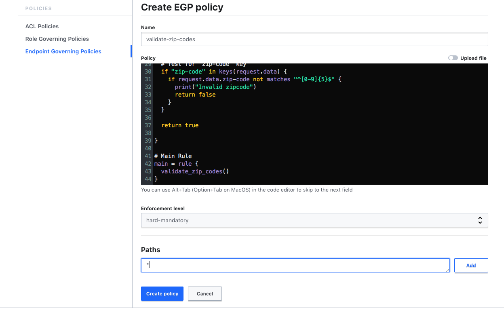

# Sentinel Validation Policies
This guide illustrates how Sentinel can be used in Vault Enterprise to validate that specific keys of secrets adhere to certain formats.  It includes policies that validate zip codes, state codes, AWS keys, and Azure credentials. It also includes a policy that requires the `delete_version_after` metadata property of KV v2 secrets to be less than 30 days (720 hours). This restricts the duration of versions of secrets; after this amount of time, each version is deleted. In addition to providing 5 Sentinel policies along with corresponding test cases for use with the [Sentinel Simulator](https://docs.hashicorp.com/sentinel/intro/getting-started/install), the guide shows the reader how to deploy them to a Vault server and how to test them with the Vault CLI. The policies support both versions 1 and 2 of the [KV secrets engine](https://www.vaultproject.io/docs/secrets/kv/index.html).

## Reference Material
Documentation on how Sentinel can be used in Vault Enterprise can be found [here](https://www.vaultproject.io/docs/enterprise/sentinel/index.html).

## Estimated Time to Complete
This guide should take 10-15 minutes.

## Personas
In an enterprise setting, the Vault administrator or other members of the security team might want to set up Sentinel policies like these to ensure that secrets written to Vault adhere to desired formats.

## Challenge
Traditionally, when people write secrets to Vault, there is no way to validate that the values of specific keys have desired formats.

## Solution
Sentinel allows Vault Enterprise customers to remedy that by checking that keys with specified names adhere to the desired formats.  Additoinally, the policies can be restricted to only apply when a secret includes multiple related keys or occurs on specific Vault paths.

## Prerequisites
You will need to have a Vault Enterprise server or cluster deployed and have a valid license for it. See [Vault Enterprise Trial](https://www.hashicorp.com/products/vault/trial).  You will also need a root token for your Vault server or a token or user ID that allows you to add Sentinel policies and a non-root token or user ID that you can use to write secrets that test the policies.  (Sentinel policies are not applied to root tokens.)

We used Vault Enterprise 1.2.2 when writing this guide.

## Steps
The steps below show you how to deploy the policies in this directory of this repository. You will use the Vault UI to create your Sentinel policies and the Vault CLI to test them.  We assume that you are using the default Vault Enterprise [namespace](https://www.vaultproject.io/docs/enterprise/namespaces/index.html).

### Step 1: Login to the UI of Your Vault Server
Login to the UI of your Vault server with a root token or with some other token or user ID that is allowed to create Sentinel policies

### Step 2: Configure an Instance of the KV Secrets Engine
In this step, you will configure a terminal session to talk to your Vault server and create an instance of the KV secrets engine so that you can use the Vault CLI to test your policies. You can use version 1 or 2 of the KV secrets engine. You could also use an existing instance of the KV secrets engine. (We show examples for version 1.)
1. Open a terminal session on your laptop.
1. Run `export VAULT_ADDR=<vault_address>` where "\<vault_address\>" is the address of your Vault server including "http" or "https" and the port (usually 8200).  If running locally without TLS enabled, this would be "http://127.0.0.1:8200".
1. Run `export VAULT_TOKEN=<token>` where "\<token\>" is a root token or one that is allowed to create an instance of the Vault [KV secrets engine](https://www.vaultproject.io/docs/secrets/kv/kv-v1.html).
1. Run `vault secrets enable -version=1 kv` to create a new instance of the KV secrets engine at the path "kv".
1. Validate that you can write a secret from your terminal session with a command like `vault kv put kv/test number=1`.
1. Validate that you can read back the secret you wrote with a command like `vault kv get kv/test`.

### Step 3: Create a Non-root Token that Can Read and Write Secrets
In this step, you will create a non-root token that can read and write secrets in the KV secrets engine that you are using or just created.
1. In the Vault UI, click the *Policies* tab.
1. Click the *ACL Policies* link on the left-hand menu.
1. Click the *Create ACL policy +* link.
1. Type "use-secrets" in the Name field and the following text in the Policy field:
```
# Access to kv/
path "kv/*" {
  capabilities = ["create", "read", "update", "delete", "list"]
}
```
1. Click the *Create policy* button to save the policy.
1. In your terminal session, run `vault token create -policy=use-secrets` to create a non-root token that has the use-secrets policy assigned to it. Be sure to note the token returned by this command.
1. Run `export VAULT_TOKEN=<token>` where "\<token\>" is the token returned by the previous command.
1. Validate that you can write a secret with this token with a command like `vault kv put kv/test number=1`.

### Step 4: Create the validate-zip-codes Policy
In this step, you will create the validate-zip-codes policy. This policy checks whether any secret being written has a key called "zipcode", "zip_code", or "zip-code". If so, the value associated with that key must be a 5-digit number as is true of all U.S. zip codes.

Please do the following in the Vault UI:
1. Click on the *Policies* tab of the Vault UI.
1. Click on the *Endpoint Governing Policies* link on the left-hand menu.
1. Click on the *Create EGP Policy +* link in the upper-right corner.
1. Type "validate-zip-codes" in the Name field.
1. Copy the contents of [validate-zip-codes.sentinel](./validate-zip-codes.sentinel) into the Policy field.
1. Leave the Enforcement level set to "hard-mandatory".
1. Set the Paths field to `*`.
1. Click the *Create policy* button.



### Step 5: Test the validate-zip-codes Policy
In this step, you will test the validate-zip-codes policy with the Vault CLI by trying to write secrets with zip codes that do and do not conform with the policy.
1. Try to write a zip code that has 5 digits with a command like `vault kv put kv/address zipcode=12345`. This should return "Success! Data written to: kv/address" since "12345" is a valid 5-digit zip code.
1. Try to write a zip code that has 4 digits and a letter with a command like `vault kv put kv/address zipcode=1234a`. This should return a long error message including a description of the Sentinel policy that failed, the path you tried to write to, *kv/address*, the request data, and the text "Invalid zip code" which is printed by the policy whenever a zip code is invalid.
1. Try to write a zip code that has 6 digits with a command like `vault kv put kv/address zipcode=123456`. This will also fail with a similar message.

*Note*: If the second and third commands in this step do not fail, make sure that you are using a non-root token.  Sentinel policies are _not_ applied to root tokens.

### Step 6: Create the validate-state-codes Policy
Repeat the steps in Step 4, but call the policy validate-state-codes and use the contents of [validate-state-codes.sentinel](./validate-state-codes.sentinel). This policy checks whether any secret being written has a key called "state" and requires that the value associated with it must be a valid U.S. state code such as "NY", "CA", or "VT".

### Step 7: Test the validate-state-codes Policy
In this step, you will test the validate-state-codes policy with the Vault CLI by trying to write secrets with state codes that do and do not conform with the policy.
1. Try to write a valid state code with a command like `vault kv put kv/address state=NY`. This should return "Success! Data written to: kv/address" since "NY" is a valid state code.
1. Try to write an invalid state code with a command like `vault kv put kv/address state=NN`. This should return a long error message including a description of the Sentinel policy that failed, the path you tried to write to, *kv/address*, the request data, and the text "Invalid state code" which is printed by the policy whenever a state code is invalid.

### Step 8: Create the validate-aws-keys Policy
Repeat the steps in Step 4, but call the policy validate-aws-keys and use the contents of [validate-aws-keys.sentinel](./validate-aws-keys.sentinel). This policy checks whether any secret being written has both of the keys "access_key" and "secret_key" which are used by AWS IAM keys set when configuring Vault's AWS secrets engine and AWS auth method. If both keys are present, the policy requires that the values assigned to the "access_key" and "secret_key" keys be 20 character and 40 character strings respectively with characters allowed by AWS.

### Step 9: Test the validate-aws-keys Policy
In this step, you will test the validate-aws-keys policy with the Vault CLI by trying to write secrets with AWS keys that do and do not conform with the policy. Normally, you would be writing secrets to paths like "aws/config/root" for the AWS secrets engine or "auth/aws/config/client" for the AWS auth method. But we will use other paths below.
1. Try to write some valid AWS keys with a command like `vault kv put kv/aws/config/root access_key=AAAAABBBBBCCCCCDDDDD secret_key=AAAAABBBBBCCCCCDDDDDAAAAABBBBBCCCCCDDDDD`. This should return "Success! Data written to: kv/aws/config/root" since the keys are valid.
1. Try to write invalid AWS keys with a command like `vault kv put kv/aws/config/root access_key=AAAAA secret_key=AAAAA` for which the keys are too short. This should return a long error message including a description of the Sentinel policy that failed, the path you tried to write to, *kv/aws/config/root*, the request data, and the messages "Invalid AWS access key" and "Invalid AWS secret key" which is printed by the policy whenever the keys are invalid.
1. If you want, test additional things such as keys that are the right length but contain invalid characters (only A-Z and 0-9 are allowed).

### Step 10: Create the validate-azure-credentials Policy
Repeat the steps in Step 4, but call the policy validate-azure-credentials and use the contents of [validate-azure-credentials.sentinel](./validate-azure-credentials.sentinel). This policy checks whether any secret being written has the "tenant_id", "client_id", and "client_secret" keys used by Vault's Azure secrets engine and Azure auth method. If so, it requires that the values associated with those keys as well as the value associated with the "subscription_id" key if present all adhere to Azure requirements. While the "subscription_id" key will always be used when setting up an instance of the Azure secrets engine, we don't require  it to be present because it is not used by the Azure auth method.

### Step 11: Test the validate-azure-credentials Policy
In this step, you will test the validate-azure-credentials policy with the Vault CLI by trying to write secrets with Azure credentials that do and do not conform with the policy. Normally, you would be writing secrets to paths like "azure/config" for the Azure secrets engine or "auth/azure/config" for the Azure auth method. But we will use other paths below.
1. Try to write valid Azure credentials with a command like `vault kv put kv/azure/config subscription_id=aaaabbbb-cccc-dddd-eeee-ffffgggghhhh tenant_id=aaaabbbb-cccc-dddd-eeee-ffffgggghhhh client_id=aaaabbbb-cccc-dddd-eeee-ffffgggghhhh client_secret=aaaabbbb-cccc-dddd-eeee-ffffgggghhhh`. This should return "Success! Data written to: kv/azure/config" since the credentials are valid.
1. Try to write invalid Azure credentials with a command like `vault kv put kv/azure/config subscription_id=AAAABBBB-CCCC-DDDD-EEEE-FFFFGGGGHHHH tenant_id=AAAAbbbb-cccc-dddd-eeee-ffffgggghhhh client_id=aaaabbbb-cccc-dddd-eeee-ffffgggghhhh client_secret=aaaabbbb-cccc-dddd-eeee-ffffgggghhhh`. This will give a long error message including the messages "Invalid Azure subscription ID" and "Invalid Azure tenant ID" since those two keys have upper-case letters that are not allowed in Azure credentials.

### Step 12: Create the validate-delete-version-after-setting Policy
Repeat the steps in Step 4, but call the policy validate-delete-version-after-setting and use the contents of [validate-delete-version-after-setting.sentinel](./validate-delete-version-after-setting.sentinel). This policy checks whether writes done against the KV v2 secret engine's `<path>/metadata` paths have their `delete_version_after` value set to less than 30 days (720 hours).

Note that the `delete_version_after` key allows formats like "300h", "5h15m", and "2h30m15s" where "h" stands for hours, "m" stands for minutes, and "s" stands for seconds. Note that the policy rolls seconds up to minutes if greater than 60 and that it rolls minutes up to hours if greater than 60.  This protects against someone trying to enter large time with a very large number of minutes or seconds.

### Step 13: Test the validate-delete-version-after-setting Policy
In this step, you will test the validate-delete-version-after-setting policy with the Vault CLI by trying to write values of `delete_version_after` that are less than and greater than 720 hours. Normally, you would be writing secrets to paths like "kv2/metadata/address" for secrets in the KV v2 secrets engine. But we will use other paths below.
1. Try to write an allowed value using hours with a command like `vault write kv/metadata/address max_versions=100 cas_required=false delete_version_after="400h"`. This should return "Success! Data written to: kv/metadata/address" since "400h" is allowed.
1. Try to write an allowed value using seconds with a command like `vault write kv/metadata/address max_versions=100 cas_required=false delete_version_after="2591999s"`. This should return "Success! Data written to: kv/metadata/address" since 720 hours is equal to 2,592,000 seconds.
1. Try to write an unallowed value with a command like `vault write kv/metadata/address max_versions=100 cas_required=false delete_version_after="800h"`. This will give a long error message including printouts of the number of hours, minutes, and seconds with the messages "Invalid value of delete_version_after" and "It must be under 720 hours".
1. Try to write an unallowed value with a command like `vault write kv/metadata/address max_versions=100 cas_required=false delete_version_after="2592000s"`. This will give a long error message including printouts of the number of hours, minutes, and seconds with the messages "Invalid value of delete_version_after" and "It must be under 720 hours".

## Testing Policies with the Sentinel Simulator
You can test the policies with the Sentinel Simulator after [downloading](https://docs.hashicorp.com/sentinel/downloads) it and putting it in your path.

To test the included test cases against the policies, please do the following:
1. Clone or fork this repository.
1. Navigate to the governance/validation-policies directory.
1. Run these commands:
```
sentinel test -run=zip
sentinel test -run=state
sentinel test -run=aws
sentinel test -run=azure
sentinel test -run=delete
```
1. To see verbose output including things the policies print, add the `-verbose` flag to these commands.

## Conclusion
In this guide, you have learned how Sentinel policies can be used in Vault Enterprise to validate the content of secrets. In particular, you have tested policies that validate zip codes, state codes, AWS keys, and Azure credentials against the Vault KV Secrets Engine. You have also seen how Vault can restrict how long versions of secrets are kept before being deleted. You have also tested the policies with the Sentinel Simulator using test cases that we provided.
