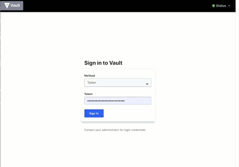

# Vault OpenID Demo
Vault 1.1.0 introduced OIDC Redirect Flow Support, allowing authentication using browser. In this repository we describe the steps to integrate this feature to authenticate with Vault using a Gmail address.



## Requirements
- Vault server with a "demo" ACL policy
- A domain name for Vault
- Google account

## Configure Vault Domain
You can use any registrar, no specific requirements. If you decide to use AWS Route53:
1. Log in to AWS, go to Route53
2. Create a Hosted Zone if none exist
3. Click on existing Hosted Zone
4. Click Create Record Set
5. Enter a name and update the IP value, as shown here:


6. Throughout this repo, assume that "YOUR_VAULT_ADDR" is this address, example: 
```
YOUR_VAULT_ADDR=http://stenio.vault.hashidemos.io:8200
```

## Configure Google
1. Go to https://console.developers.google.com/apis/credentials/, log in if needed
2. Click "Create credentials > OAuth ClientID"
3. Select "Web application", give it a name
4. On "Authorized redirect URIs", enter "http://YOUR_VAULT_ADDR//ui/vault/auth/oidc/oidc/callback"
5. Press Save
6. In the next step you will use the Client ID and the Client Secret when configuring Vault

## Configure Vault
1. Enable oidc auth and configure it with the Google client information:
```
vault auth enable oidc

vault write auth/oidc/config \
    oidc_discovery_url="https://accounts.google.com" \
    oidc_client_id="YOUR_GOOGLE_API_CLIENT_ID" \
    oidc_client_secret="YOUR_GOOGLE_API_CLIENT_SECRET" \
    default_role="gmail"

```
2. Create a role to use for authentication. You can be as restrictive as desired by using the different "bound" fields. These allow you to specify values that need to be present from Google in order to allow authentication. [Here](https://developers.google.com/identity/protocols/OpenIDConnect#obtainuserinfo) documentation on claims and values sent by Google, [here](https://www.vaultproject.io/api/auth/jwt/index.html#create-role) information on the bound fields.
```
vault write auth/oidc/role/gmail \
    user_claim="sub" \
    bound_audiences=[YOUR_GOOGLE_API_CLIENT_ID] \
    allowed_redirect_uris="http://YOUR_VAULT_ADDR//ui/vault/auth/oidc/oidc/callback" \
    policies=demo \
    ttl=1h
```

## Login
1. Go to Vault UI
2. Select "OIDC auth"
3. Enter the role you want to log in to Vault with. In this example we only have one role, but multiple can be created and associated with different claims and bounds as needed.
4. Log in!
