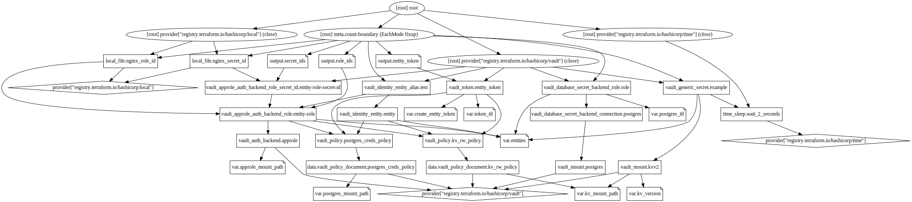
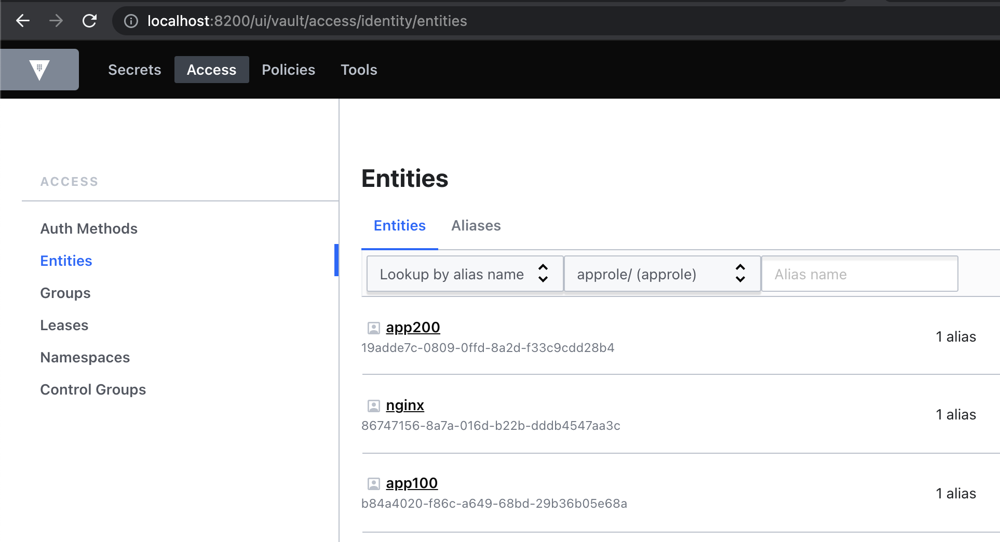
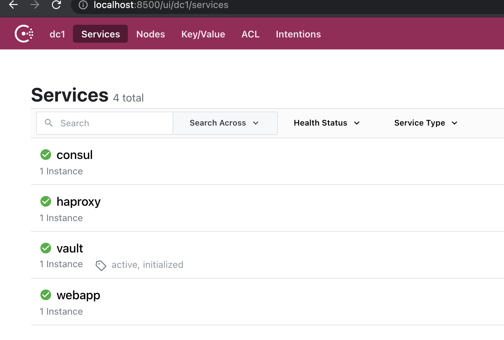

## Onboarding Applications to Vault using Terraform

This repo contains the source code for the onboarding approach described in this [blog post (pending)](pending). Please use the steps below to provision a Vault cluster and onboard an example application.

### Provision demo Vault cluster and application using Docker compose
Please clone the repository as below and cd into the project directory:
```bash
git clone git@github.com:hashicorp/vault-guides.git
cd vault-guides/operations/onboarding
```

Please `cd` into the docker-compose directory and run docker compose up as shown below. The remaining terminal snippets in this post will assume that you are in the project directory vault-guides/operations/onboarding.
```bash
cd docker-compose/ && docker compose up
```
Optionally, if you prefer using the tool make, there is a Makefile included in the project directory root. Run make info to see the available targets.

### Bootstrap Vault
Perform the following steps from a separate terminal. The original terminal will continue to output any log messages from various containers included within Docker Compose.
```bash
# Assuming you are in the project root directory
cd docker-compose/scripts
00-init.sh
export VAULT_ADDR=http://localhost:8200
export VAULT_TOKEN=<token-from-init-script>
vault token lookup
```

**Admin Token (optional)**
You may prefer using an Admin token instead of Root, for example if using an existing cluster. If so, please create an admin token using the vault-admin.hcl policy file as shown below. This admin policy was based on the [Vault Policies learn guide](https://learn.hashicorp.com/tutorials/vault/policies#write-a-policy).
```bash
vault policy write learn-admin admin-policy.hcl
vault token create -policy=learn-admin
export VAULT_TOKEN=<token-from-above command>
vault token lookup
```

### Terraform configuration
We will use Terraform to create the following items: Application Entity, ACL Policy, Authentication Method Role, and Secret Engine Role. In the file variables.tf, we have declared an `entities` variable that will hold a list of applications. 

The default list contains `nginx` and `app100` by default. Please run the following commands to create all of the corresponding configurations to onboard these applications. 
```bash
# Please ensure you have VAULT_ADDR and Root or Admin VAULT_TOKEN set
# Assuming you are in the scripts/ directory
cd ../../terraform
terraform init
terraform plan
terraform apply --auto-approve
```

Please run the command `docker restart vault-agent`, and you should now be able to see the nginx container display a dynamic Postgres database password on http://localhost:8080. Also try accessing http://localhost:8080/kv.html to see nginx display example values stored in the Key/Value secrets engine.

The full terraform graph has been exported in the file [graph.svg](./webassets/graph.svg) - also shown below. To generate this type of graph yourself, please use the command: `terraform graph | dot -Tsvg > ~/Downloads/graph.svg`


### Onboarding another application
To onboard another application, simply add to the default values for `entities` in the file [variables.tf](./terraform/variables.tf). For example, below is a snippet showing `app200` appended to the entities variable list:
```bash
    default = [
        "nginx",
        "app100",
        "app200"
    ]
```

Then run `terraform plan` and `terraform apply` to create the necessary Vault configurations for this application. Since we are using policy templates, there is no need to create a new Policy. Verify from the Vault UI that there is a new entity called `app200`, with an alias to the AppRole Auth method:


A new Role ID and Secret ID has also been created which can be obtained from `terraform output`. Please use the commands shown below to display the Role ID and Secret ID, then login using AppRole and read Secrets. Note that you Role ID, Secret ID and Vault Token will be different.
```bash
# Get Approle creds
terraform output role_ids | grep app200
  "app200" = "ff2795c9-7f42-4233-eace-075c28869199"
terraform output secret_ids | grep app200
  "app200" = "e76ed3e5-e2c5-fd9e-14f1-554b40674d54"
# Login using AppRole
vault write auth/approle/login \
  role_id=ff2795c9-7f42-4233-eace-075c28869199 \
  secret_id=e76ed3e5-e2c5-fd9e-14f1-554b40674d54
Key                     Value
---                     -----
token                   s.JGHR7HEc0I51kOvYSfR1SfGj
token_accessor          RgOTOtM2InSfF8oz62tvOOZF
token_duration          768h
token_renewable         true
token_policies          ["default" "kv_rw_policy" "postgres_creds_policy"]
identity_policies       ["kv_rw_policy" "postgres_creds_policy"]
policies                ["default" "kv_rw_policy" "postgres_creds_policy"]
token_meta_role_name    app200
# Read KV secret
export VAULT_TOKEN=s.JGHR7HEc0I51kOvYSfR1SfGj
vault kv get kv/app200/static
====== Metadata ======
Key              Value
---              -----
created_time     2021-06-05T13:44:18.9141257Z
deletion_time    n/a
destroyed        false
version          1
====== Data ======
Key         Value
---         -----
app         app200
password    cheese
username    app200
```
To de-board an application, simply remove the entity from the same variable and re-rerun `terraform apply`.

### Cleanup
To remove all provisioned Vault configurations and docker containers, please run the [cleanup.sh](./docker-compose/scripts/cleanup.sh) as shown below. Alternatively, you can run `make clean` from the project root directory.
```bash
# Assuming you are in the terraform/ directory
cd ../docker-compose/scripts
./cleanup.sh
```

### Docker Compose Cluster - accessing Vault and Consul
This information is FYI only in case anyone is interested about the Vault and Consul services created by Docker.

The [docker-compose.yml](./docker-compose/docker-compose.yml) file creates a Vault 1.7 Enterprise cluster with 3 Vault nodes, one Consul Server node, and three Consul Client nodes. There is also an HAProxy Load Balancer that is created in case you want to round-robin the requests across all three nodes in the Docker-compose Vault cluster. Below are how they can be accessed from localhost: 
- haproxy: http://localhost:9200
- vault_s1: http://localhost:8200
- vault_s2: http://localhost:18200
- vault_s3: http://localhost:38200
- consul_s1: http://localhost:8500

The URL for haproxy or any of the vault server nodes can be used to access Vault from the host. Below is a screenshot from Consul showing all registered services after running the `00-init.sh` script.


Note that since we are using Vault 1.7 Enterprise, the node will automatically seal themselves after 6 hours. You can reprovision the full stack by running the commands `docker compose up` and `docker compose down`. Alternatively, you can change the `image:` tag in [docker-compose.yml](./docker-compose/docker-compose.yml) to a Vault OSS image as shown below. This demo does not require Vault Enterprise.
```bash
vault_s1:
  #image: hashicorp/vault-enterprise:latest
  image: hashicorp/vault:latest
  restart: always 
```
